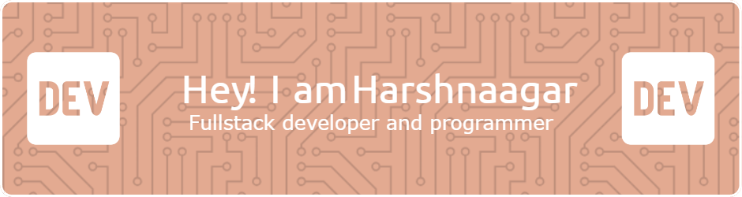

 
👯 I’m looking to collaborate on fullstack web projects. 🌱 I’m currently learning fullstack development and dsa with c++. 💬 Ask me about react , express , c++ , python . 📫 Contect me at hnaagar12@gmail.com .

## 🌐 Socials:

# 💻 Tech Stack:

# 📊 GitHub Stats:
 
 

 

## 🏆 GitHub Trophies

**Commits:**

<!-- Proudly created with GPRM ( https://gprm.itsvg.in ) -->
